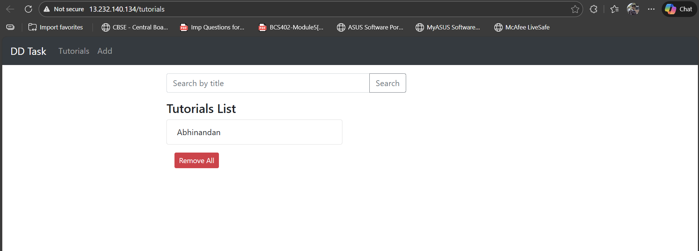
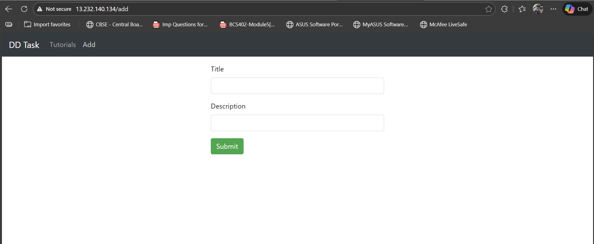
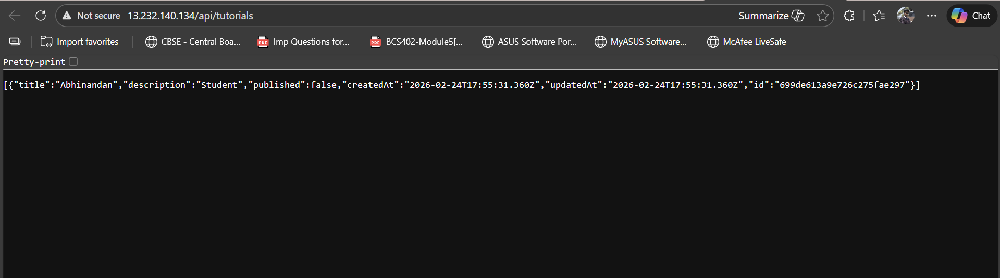
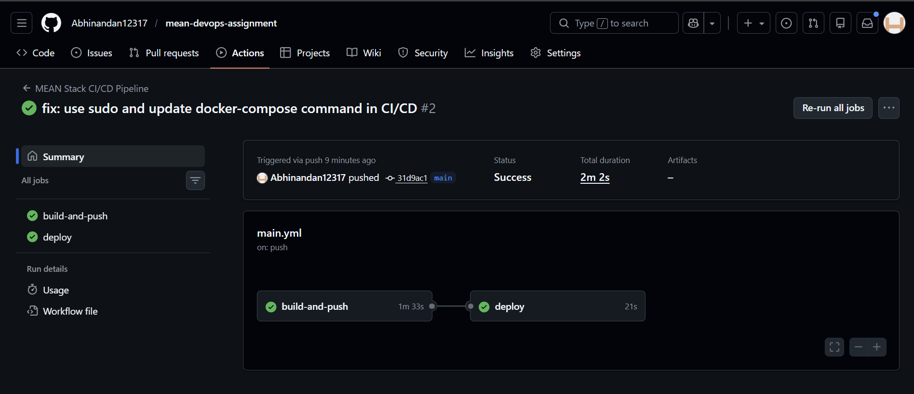

# 🚀 MEAN Stack DevOps Deployment Task

This repository contains the full-stack deployment of a MEAN (MongoDB, Express, Angular, Node.js) application, featuring automated CI/CD pipelines, containerization, and a secure Nginx reverse proxy. 

**Candidate:** Abhinandan 
**Task:** Discover Dollar DevOps Internship Assignment

---

## 🔗 Live Deployment
- **Application Link:** [http://13.232.140.134/](http://13.232.140.134/)
- **Backend API Check:** [http://13.232.140.134/api/tutorials](http://13.232.140.134/api/tutorials)

---

## 🏗️ System Architecture
The application is deployed using a modular, containerized architecture:

```text
[ Browser ] --(Port 80)--> [ Nginx Proxy ]
                                 |
           ---------------------------------------------
           |                                           |
    [ Frontend UI ]                             [ Backend API ]
    (Angular Container)                       (Node.js Container)
                                                       |
                                                [ Database ]
                                             (MongoDB Container)
```

- **Reverse Proxy:** Nginx acts as the single entry point, routing traffic based on URL patterns.
- **Networking:** All containers communicate via a private Docker bridge network (`app-network`).
- **Persistence:** MongoDB uses a Docker volume for data persistence across container restarts.

---

## 🛠️ Technology Stack
- **Frontend:** Angular 15 (Multi-stage Docker build)
- **Backend:** Node.js & Express
- **Database:** MongoDB
- **Infrastructure:** AWS EC2 (Ubuntu 22.04)
- **Containerization:** Docker & Docker Compose
- **CI/CD:** GitHub Actions
- **Web Server:** Nginx (Reverse Proxy)

---

## 🔄 CI/CD Pipeline Implementation
The pipeline is automated via GitHub Actions (`.github/workflows/main.yml`). It triggers on every push to the `main` branch.

### Pipeline Stages:
1. **Dockerize:**
   - Authenticates with Docker Hub.
   - Builds production-ready images for both Frontend and Backend.
   - Pushes images to Docker Hub (`abhinandan069/`).
2. **Auto-Deploy:**
   - Established a secure SSH connection to the AWS EC2 instance.
   - Pulls the latest images from the registry.
   - Restarts the stack using `docker compose up -d --force-recreate`.
   - Cleans up dangling images to save disk space.

---

## 📦 Project Structure
```text
.
├── backend/            # Node.js API server
│   ├── Dockerfile      # Production backend image
│   └── ...
├── frontend/           # Angular frontend
│   ├── Dockerfile      # Multi-stage production build
│   └── ...
├── .github/workflows/  # CI/CD Pipeline configuration
├── docker-compose.yml  # Orchestration for the full stack
├── nginx.conf          # Reverse proxy configuration
└── README.md           # Documentation
```

---

## ⚙️ Setup & Deployment Guide

### Local Development
To run this project locally, ensure you have Docker installed:
```bash
git clone https://github.com/Abhinandan12317/mean-devops-assignment.git
cd mean-devops-assignment
docker compose up --build
```
Access the application at `http://localhost`.

### Production Deployment (EC2)
1. **Provision VM:** Set up an Ubuntu 22.04 EC2 instance on AWS.
2. **Install Docker:** Install Docker and the Docker Compose plugin.
3. **Configure Gateway:** Place `docker-compose.yml` and `nginx.conf` in `~/mean-app/`.
4. **Open Ports:** In AWS Security Groups, allow:
   - Port 80 (HTTP)
   - Port 22 (SSH)

### GitHub Configuration
Add the following secrets to your repository:
- `DOCKER_USERNAME`: Your Docker Hub username.
- `DOCKER_PASSWORD`: Your Docker Hub password.
- `EC2_HOST`: `13.232.140.134`
- `EC2_SSH_KEY`: Content of your `.pem` private key.

---

## 📸 Screenshots & Verification

### 1. Application UI (Home Page)

*The application successfully loads on the EC2 IP and displays the tutorial list.*

### 2. Add Tutorial Form

*The Angular routing correctly navigates to the /add page.*

### 3. Backend API Validation

*Accessing /api/tutorials returns the JSON data from MongoDB via the Nginx proxy.*

### 4. CI/CD Operations (GitHub Actions)

*Automated pipeline successfully building and deploying the whole stack.*

---
*Created with ❤️ for the Discover Dollar Recruitment Process.*
